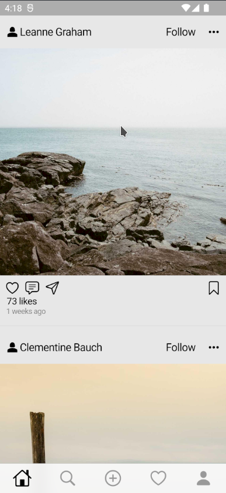

# Instagram Clone

This is an Instagram clone built with Flutter. It aims to replicate the core functionality of the Instagram application, allowing users to view and upload photos, follow other users, and engage with posts through likes and comments.

## Features

- **User Authentication:** Users can sign up, log in, and log out of the application. User credentials are securely stored and authenticated using Firebase Authentication.

- **Photo Feed:** Users can view a feed of photos uploaded by other users. The app uses a placeholder image API to display images until real images are uploaded.

- **Profile Pages:** Each user has a profile page that displays their uploaded photos, follower count, following count, and other profile details. Users can also edit their profile information.

- **Follow/Unfollow Users:** Users can follow and unfollow other users to stay updated with their posts. The follower/following counts are updated accordingly.

- **Upload Photos:** Users can upload their own photos, add captions, and share them with their followers. The app uses a placeholder image API to display the uploaded photos until real images are uploaded.

- **Likes and Comments:** Users can like and comment on posts. The number of likes and comments is updated in real-time.

- **Explore Page:** Users can discover new posts and users through the Explore page, which suggests popular and trending posts.

- **Direct Messaging:** Users can send private messages to other users and engage in one-on-one conversations.

## Screenshots

## Acknowledgements

- This app uses the [Placeholder Image API](https://picsum.photos/) for displaying placeholder images.
- Thanks to the Flutter and Dart communities for their excellent documentation and support.